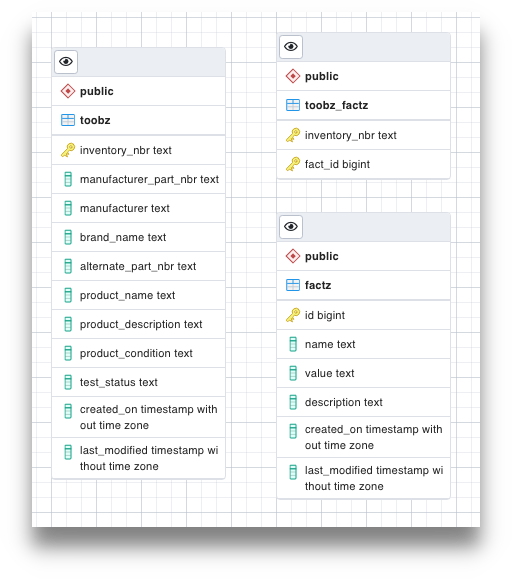

# toobz-db

The database for `toobz-api`. Really, it can be any old PostgreSQL database. Doesn't even have to run in a container,
although this one does.

## Contents

`start-container.sh` is just a wrapper script to start a PostgreSQL database to be used by `toobz-api`.
It can be used with the defaults, or it will accept parameters as environemnt variables, reading them from a file
named `.env-container` which, for obvious reasons, is included in `.gitignore` and therefore is not present in
this repo. The `dotenv` file, however, is included as an example that you can customize to your environment(s) and rename.

## Schema

The `toobz` database does not need to be populated or its schema created--it just needs to exist. The `toobz-api` will take care of initializing everything, if necessary.

That being said, the schema looks like this:

FK constraints are handled in the application layer because (a) it's a simple schema, (b) it's more flexible, and (c) I'm lazy.

## Technologies used

* [PostgreSQL](https://postgresql.org) because it is just generally awesome
* [Docker](https://docker.com) because containers are convenient, and Docker is, well, adequate

## License

MIT
